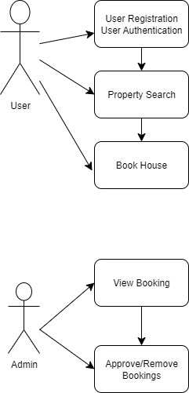

# What is Requirement Analysis?
Requirement Analysis is the systematic process of identifying, documenting, validating, and managing the needs and expectations of stakeholders for a software system. It acts as the bridge between business objectives and technical implementation, ensuring the final product aligns with user needs and organizational goals.

# Why is Requirement Analysis Important?

1.Foundation for Success. Poorly analyzed requirements cause ~70% of project failures (standish Group). Clear requirements reduce rework costs by up to 10x (IBM).

2. Stakeholder Alignment. Resolves conflicts early (e.g., balancing user needs vs. technical feasibility).

3. Scope Control. Prevents scope creep by defining boundaries (e.g., "The system will support 10,000 concurrent users, not 100,000").

4. Risk Mitigation. Identifies risks early (e.g., regulatory compliance gaps).

5. Efficient Resource Allocation. Guides realistic timelines and budgets (e.g., "Integrating payment gateways requires 3 months").

6. Quality Assurance. Serves as a benchmark for testing (e.g., "Test case TC-01 validates login functionality").

# Key Activities in Requirement Analysis.

<b>Requirement Gathering - </b>This process involved the collection of needs and expectations from the stakeholders.

<b>Requirement Elicitation - </b>This process invloves getting unstated needs through direct engagement.

<b>Requirement Documentation - </b>This is the recording of the requirements as captured from the stakeholders.

<b>Requirement Analysis and Modeling - </b>This process involves structuring the requirements into actionalble blueprints.

<b>Requirement Validation - </b>This process invloves having the stakeholders to sign off on the requirements.

# Types of Requirements

<b>Functional Requirements</b> describe what the system must do while <b>Non-Functional Requirements</b> describe how the system should perform.

<h3>Examples of Functional Requirements</h3>

User registration and Authentication

Property Listing Management

<h3>Examples of Non Functional Requirements</h3>

Performance - Search results load in less than 2secs

Scalability - Handle traffic spikes

# Use Case Diagrams

